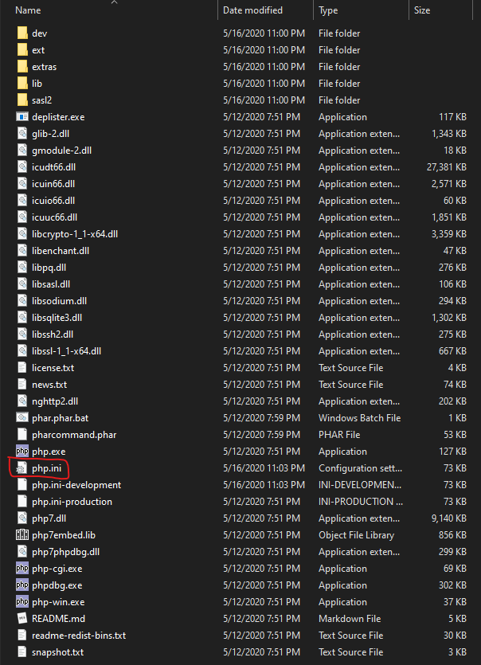
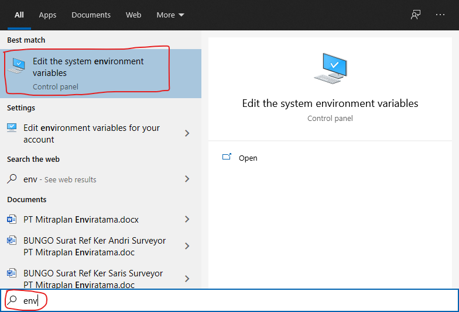
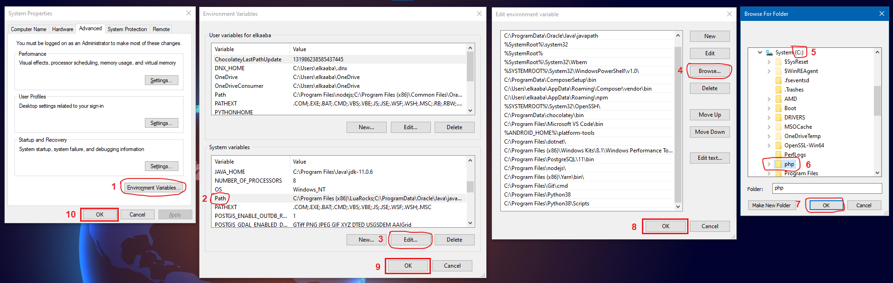

# Instalasi PHP di Windows

- Download dan install Visual C++ Redistributable for Visual Studio 2015. **[DOWNLOAD LINK](https://www.microsoft.com/en-us/download/details.aspx?id=48145)**
- Download PHP 7.4.7 untuk Windows 64-bit. **[DOWNLOAD LINK](https://windows.php.net/downloads/releases/php-7.4.7-nts-Win32-vc15-x64.zip)**
- Extract file `php-7.4.7-nts-Win32-vc15-x64.zip` ke folder `C:\php`
- Download file **[php.ini](https://raw.githubusercontent.com/hanreev/service-example/master/php/stubs/php.ini)** dan copy ke folder `C:\php`

  

- Tambahkan folder `C:\php` ke dalam `PATH` environment variable

  - Ketik `env` di windows search (`Win` + `S`) kemudian klik `Edit the system environment variables`

    

  - Klik `Enviroment Variables`
  - Pilih `Path` di bagian `System variables` kemudian klik `Edit`
  - Klik `Browse` kemudian pilih folder `C:\php` lalu klik `OK`
  - Klik `OK` di semua window yang lain

    
